# System Design & Architecture

## Architecture Overview

```mermaid
flowchart LR
    A["📁 ad_data.csv\n(995MB)"] --> B["📖 Polars\nscan_csv()"]
    B --> C["⚡ LazyFrame\nGroupBy + Agg"]
    C --> D["📊 Calculate\nCTR & CPA"]
    D --> E["🔝 Sort & Filter\nTop 10"]
    E --> F["💾 top10_ctr.csv"]
    E --> G["💾 top10_cpa.csv"]

    H["🖥️ CLI\n(Click)"] --> B
    I["📈 Benchmarker"] -.-> B
    I -.-> C
    I -.-> D
    I -.-> E
```

### Key Components
| Component      | Responsibility                          | Technology    |
|----------------|-----------------------------------------|---------------|
| CLI Interface  | Parse args, orchestrate pipeline        | Click         |
| CSV Reader     | Lazy-load CSV, validate schema          | Polars        |
| Aggregator     | GroupBy campaign_id, sum metrics         | Polars        |
| Calculator     | Compute CTR, CPA with edge cases        | Polars        |
| Writer         | Output sorted Top 10 to CSV             | Polars        |
| Benchmarker    | Track time, memory, throughput          | time, tracemalloc |

## Technology Stack & Rationale

| Choice              | Rationale                                           |
|---------------------|-----------------------------------------------------|
| **Python 3.12**     | Mature ecosystem, great CLI/data libs               |
| **Polars**          | Rust-based, 10-100x faster than pandas on large data |
| **Polars LazyFrame**| Deferred execution, query optimization, streaming   |
| **Click**           | Clean CLI API, auto-help, type validation           |
| **tracemalloc**     | Built-in memory profiling, no extra deps            |

### Why Polars over Pandas?
- **Performance**: Polars uses Rust under the hood, significantly faster for aggregations
- **Memory**: LazyFrame evaluates lazily — only materializes what's needed
- **Streaming**: `scan_csv()` doesn't load entire file into memory at once
- **Parallelism**: Automatic multi-threaded execution
- **Type safety**: Strict schema enforcement

## Data Flow

## Design Decisions

### 1. Single-Pass Aggregation
All metrics are computed in one `groupby().agg()` call, minimizing disk I/O.

### 2. Lazy Evaluation
Using `pl.scan_csv()` instead of `pl.read_csv()`. Polars optimizes the query plan before execution, potentially skipping unnecessary work.

### 3. Built-in Benchmarking
`tracemalloc` + `time.perf_counter()` for accurate measurements without heavy dependencies.

### 4. Modular Design
Each concern (reading, aggregating, writing, benchmarking) is isolated in its own module for testability and maintainability.

## Error Handling Strategy
- File not found → Clear error message with exit code 1
- Invalid CSV schema → Schema validation with informative error
- Zero conversions → CPA set to null, excluded from top10_cpa
- Empty input → Graceful handling with warning message
